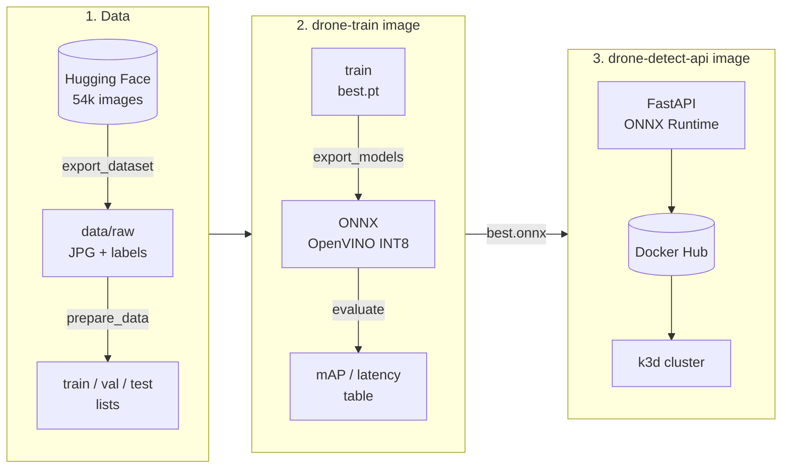

# drone-detect-mlops

Drone detection with YOLO11n, from training to a containerized inference service on Kubernetes. CPU only.

<p>
  
  
</p>

## Pipeline



Two images: `drone-train` (PyTorch, used for training, export and evaluation, code mounted from the repo) and `drone-detect-api` (serving only, no PyTorch, non-root, healthcheck).

## Roadmap

- [ ] Training
- [ ] CPU optimization (ONNX, OpenVINO INT8)
- [x] Inference API (Docker image)
- [ ] Kubernetes deployment (k3d)
- [ ] Monitoring (Prometheus, Grafana)

## Training

Dataset: [pathikg/drone-detection-dataset](https://huggingface.co/datasets/pathikg/drone-detection-dataset) (MIT), 54k images. Exported once to `data/raw/` (JPG + YOLO labels); train/val/test are lists of paths in `data/*.txt`, sizes set in `configs/train.yaml`. Images in `data/negatives/images/` are added to train as negatives.

```bash
docker compose build
docker compose run --rm train python scripts/export_dataset.py --clean-cache   # once, ~4 GB
docker compose run --rm train python scripts/prepare_data.py
docker compose run --rm train python scripts/browse_dataset.py -n 64           # results/preview/
docker compose run --rm train python scripts/train.py
docker compose run --rm train python scripts/evaluate.py --tag pytorch_cpu
```

## CPU optimization

```bash
docker compose run --rm train python scripts/export_models.py
docker compose run --rm train python scripts/evaluate.py --weights models/best.pt --tag pytorch
docker compose run --rm train python scripts/evaluate.py --weights models/best.onnx --tag onnx
docker compose run --rm train python scripts/evaluate.py --weights models/best_openvino_model --tag openvino
docker compose run --rm train python scripts/evaluate.py --weights models/best_int8_openvino_model --tag openvino_int8
docker compose run --rm train python scripts/compare.py
```

## Inference API

FastAPI + ONNX Runtime, no PyTorch in the image. Multi-stage build, non-root user, healthcheck, Prometheus metrics.

```bash
docker compose --profile api up --build api
curl -F "file=@data/raw/test/images/000000.jpg" http://localhost:8000/detect
```

| Endpoint | |
| --- | --- |
| `POST /detect` | image upload, returns boxes, confidence, inference time (`?conf=` to override the threshold) |
| `POST /detect/image` | same, returns the image with boxes drawn |
| `GET /health` | liveness / readiness |
| `GET /metrics` | request count, detections, inference latency histogram |
| `GET /docs` | Swagger UI |

## Video

```bash
docker compose run --rm train python scripts/predict_video.py data/videos --track
```

Output: `results/videos/` (annotated videos + `summary.json`).

## Results

| Model | mAP50 | mAP50-95 | Latency (ms) | FPS | Size (MB) |
| --- | --- | --- | --- | --- | --- |
