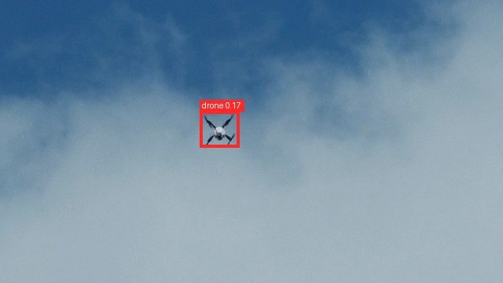
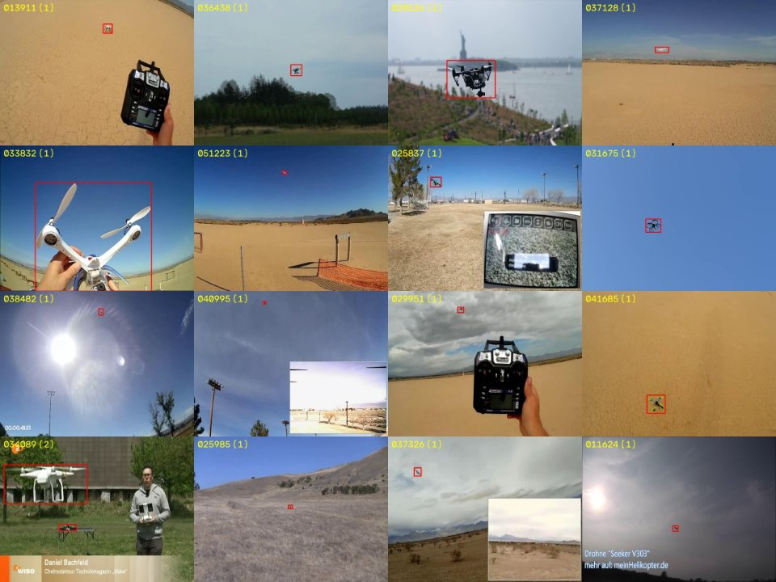
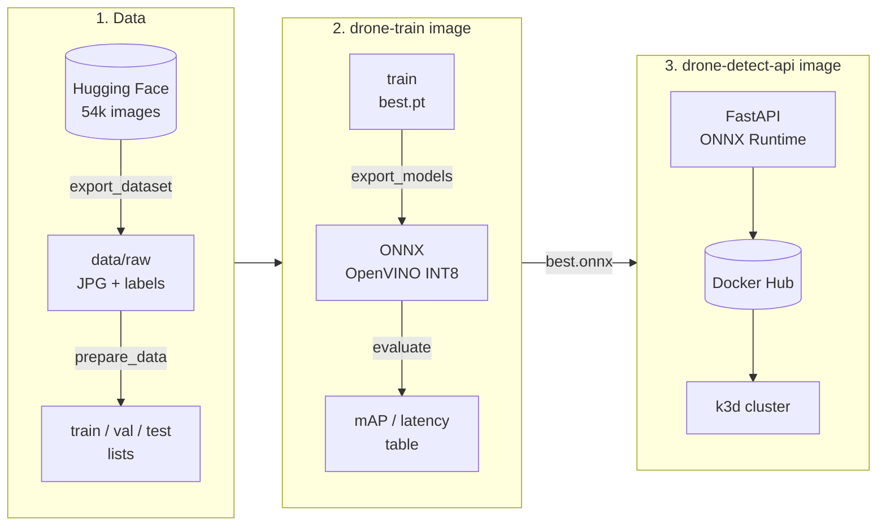

# drone-detect-mlops

Drone detection with YOLO11n, from training to a containerized inference service on Kubernetes. CPU only.

<p>
  
  
</p>

## Pipeline



Two images: `drone-train` (PyTorch, used for training, export and evaluation, code mounted from the repo) and `drone-detect-api` (serving only, no PyTorch, non-root, healthcheck).

## Roadmap

- [x] Training
- [x] CPU optimization (ONNX, OpenVINO INT8)
- [x] Inference API (Docker image)
- [ ] Kubernetes deployment (k3d)
- [ ] Monitoring (Prometheus, Grafana)

## Training

Dataset: [pathikg/drone-detection-dataset](https://huggingface.co/datasets/pathikg/drone-detection-dataset) (MIT), 54k images. Exported once to `data/raw/` (JPG + YOLO labels); train/val/test are lists of paths in `data/*.txt`, sizes set in `configs/train.yaml`. Images in `data/negatives/images/` are added to train as negatives.

```bash
docker compose build
docker compose run --rm train python scripts/export_dataset.py --clean-cache   # once, ~4 GB
docker compose run --rm train python scripts/prepare_data.py
docker compose run --rm train python scripts/browse_dataset.py -n 64           # results/preview/
docker compose run --rm train python scripts/train.py
docker compose run --rm train python scripts/evaluate.py --tag pytorch_cpu
```

## CPU optimization

```bash
docker compose run --rm train python scripts/export_models.py
docker compose run --rm train python scripts/evaluate.py --weights models/best.pt --tag pytorch
docker compose run --rm train python scripts/evaluate.py --weights models/best.onnx --tag onnx
docker compose run --rm train python scripts/evaluate.py --weights models/best_openvino_model --tag openvino
docker compose run --rm train python scripts/evaluate.py --weights models/best_int8_openvino_model --tag openvino_int8
docker compose run --rm train python scripts/compare.py --readme
```

## Public models for comparison

`scripts/fetch_pretrained.py` downloads two public drone detectors to `models/external/`, evaluated on the same test split:
[doguilmak/Drone-Detection-YOLOv11x](https://huggingface.co/doguilmak/Drone-Detection-YOLOv11x) (MIT) and
[IRIS-Computer-Vision/YOLOv8s_EO_Drone_Detection](https://huggingface.co/IRIS-Computer-Vision/YOLOv8s_EO_Drone_Detection) (CC BY-NC 4.0).

```bash
docker compose run --rm train python scripts/fetch_pretrained.py
docker compose run --rm train python scripts/evaluate.py --weights models/external/yolov8s_iris.pt --tag ext_yolov8s_iris
docker compose run --rm train python scripts/evaluate.py --weights models/external/yolo11x_doguilmak.pt --tag ext_yolo11x_doguilmak
```

## Inference API

FastAPI + ONNX Runtime, no PyTorch in the image. Multi-stage build, non-root user, healthcheck, Prometheus metrics.

Published on Docker Hub as [`leaa1324/drone-detect-api`](https://hub.docker.com/r/leaa1324/drone-detect-api):

```bash
docker run --rm -p 8000:8000 leaa1324/drone-detect-api:0.1.0
```

From source:

```bash
docker compose --profile api up --build api
curl -F "file=@data/raw/test/images/000000.jpg" http://localhost:8000/detect
```

| Endpoint | |
| --- | --- |
| `POST /detect` | image upload, returns boxes, confidence, inference time (`?conf=` to override the threshold) |
| `POST /detect/image` | same, returns the image with boxes drawn |
| `GET /health` | liveness / readiness |
| `GET /metrics` | request count, detections, inference latency histogram |
| `GET /docs` | Swagger UI |

## Video

```bash
docker compose run --rm train python scripts/predict_video.py data/videos --track
```

Output: `results/videos/` (annotated videos + `summary.json`).

## Results

Same test split for every model: 2625 images from a source not used in training (public models were trained on other data).

<!-- results:start -->
| Model | mAP50 | mAP50-95 | Latency (ms) | Size (MB) | Test images |
| --- | --- | --- | --- | --- | --- |
| YOLO11n (ours), PyTorch | 0.785 | 0.345 | 45.8 | 5.5 | 2625 |
| YOLO11n (ours), ONNX Runtime | 0.781 | 0.345 | 99.9 | 10.6 | 2625 |
| YOLO11n (ours), OpenVINO FP32 | 0.781 | 0.345 | 42.3 | 10.7 | 2625 |
| YOLO11n (ours), OpenVINO INT8 | 0.769 | 0.322 | 35.6 | 3.4 | 2625 |
| YOLOv8s, [IRIS](https://huggingface.co/IRIS-Computer-Vision/YOLOv8s_EO_Drone_Detection) | 0.194 | 0.053 | 98.6 | 22.5 | 500 |
| YOLO11x, [doguilmak](https://huggingface.co/doguilmak/Drone-Detection-YOLOv11x) | 0.547 | 0.208 | 533.8 | 114.4 | 500 |

Latency: batch 1, 640 px, CPU only (Linux-6.18.33.2-microsoft-standard-WSL2-x86_64-with-glibc2.41), inside Docker.
<!-- results:end -->
